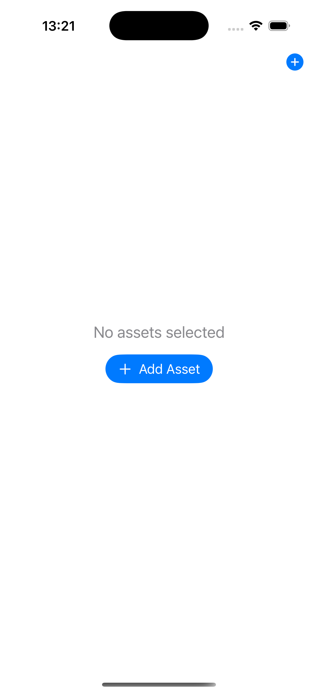

#  FxTrackR

## Basic Info
- Language: Swift 6  
- UI Framework: SwiftUI  
- Unit tests: Swift Testing  
- Caching/Offline: URLCache & UserDefaults  
- OS Version: iOS 15 and above  
- API: [https://openexchangerates.org](https://openexchangerates.org)

## Setup Instructions
1. Create Config.xcconfig file in repository root, use Config-example.xcconfig as a reference.
2. Update Config.xcconfig file with valid API key value for key `OPEN_EXCHANGE_RATES_API_KEY`.

## App Structure
As per requirements, the app has two screens:

### 1. Home Screen
The screen shows a list of selected assets with their currencies. The base currency is always USD.
  

If no assets are selected, an empty state screen is displayed.  

Users can delete assets using swipe-to-delete.  

As an alternative option, users can enable edit mode.  

Edit mode also supports asset reordering.  

### 2. Add Assets Screen
The screen displays a list of available assets. Users can add multiple assets to their list.  

During loading, the app displays a loading view.  

In case of a request failure, the app displays a failed state screen.  

Users can use the search bar to filter assets by name or code.  

